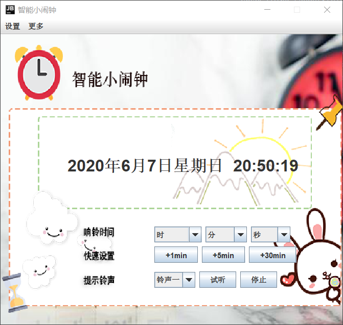

# alarm clock

java 大作业

## alarm clock 智能小闹钟

1. 课题代号： 2
2. 课题名称：多功能数字钟程序
3. 课题要求：
   ①基本要求：设计数字钟程序，可以显示当前的时间，星期，日期信息；实现闹
   钟功能，预设时间到时弹出对话框进行提醒；实现闹钟的开启和关闭设置开关并且可
   以在钟面上查看其设置状态。
   ②提高要求：闹钟提醒对话框弹出时可同时播放响铃声或音乐；增加贪睡功能，
   例如闹钟时间到时按下贪睡按钮后结束提醒，10 分钟后再次进行提醒；增加倒计时
   功能，可以预设倒计时的时间，倒计时完成后弹出对话框并播放声音提醒；增加国际
   时钟功能，可以显示预设的在不同时区的国家的当前时间，星期和日期功能；合理设
   计时钟的显示界面和功能设定界面，使操作者可以用直观并且简单的方式使用和设定
   各个功能。
4. 备注：课题要求（3）中给出的基本要求和提高要求将作为评分依据，根据大作
   业评分标准进行评分，在基本要求和提高要求以外实现的其它功能不作为评分依据。
   本大作业课题中需要的时间及日期数据直接从运行该程序的机器上获取，不需要联网
   获取时间。  

## rock-paper-scissors 猜拳

控制台能跑，没写界面，放弃了。

（1）课题代号： 1
（2）课题名称：剪刀石头布游戏程序
（3）课题要求：
①基本要求：设计单机版的剪刀石头布游戏程序。游戏可以提供人-人和人-机两种
游戏模式。工作在人-机模式时，预先在键盘上定义好剪刀石头布按键，游戏开始
后，在 3 秒倒计时中，人按下预想的某个手势(只可按一次)，倒计时结束时与机器预
想的随机手势进行比较，裁定输赢并在界面上显示获胜方。工作在人-人模式时，预
先在键盘上定义好各自的剪刀石头布按键（建议两组按键各自设计在键盘两端，便于
游戏者一手操作，一手遮挡），游戏开始后，在 3 秒倒计时中，两人按下各自预想的
某个手势(只可按一次)，倒计时结束时进行比较，裁定输赢并在界面上显示获胜方。
②提高要求：可设定多回合游戏功能，例如三回合两胜，五回合三胜等，在回合结
束后显示输赢统计数据并判定获胜方；设计在人-人模式时的防作弊功能，3 秒倒计
时内如果一方按键 1 次以上则判为作弊并显示此人作弊，此时判对方获胜；尝试设计
和实现在多回合的人-机模式时机器给出的手势算法（机器不可以使用当前回合人已
经给出的手势后给出机器的手势，但可以在之前回合的人的手势数据基础上分析给出
下一回合的手势，以提高机器的获胜率为算法指标）；游戏画面精细完善，有最佳的
动画以及声音效果。
（4）备注：课题要求（3）中给出的基本要求和提高要求将作为评分依据，根据大作
业评分标准进行评分，在基本要求和提高要求以外实现的其它功能不作为评分依据。
本大作业课题不需要设计网络版程序。  
